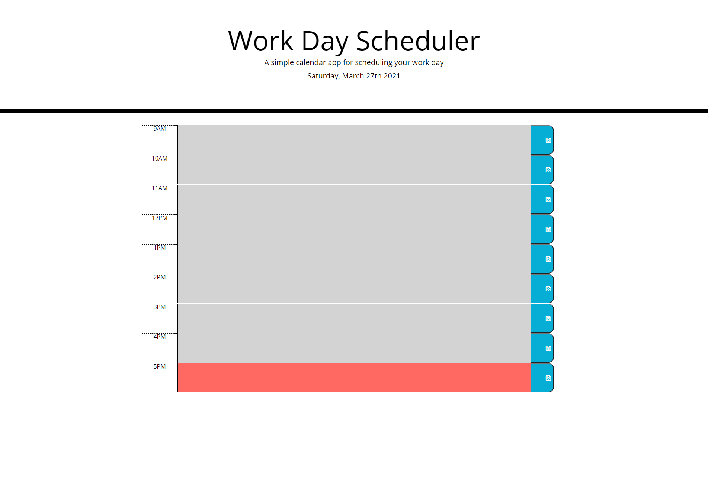

# Day-Planner
This day planner will allow users to dynamically change and add tasks/events to their planner for the day.
Each event/task will be locally stored so upon refreshing the page, the data should persist.
Here is a screenshot of the planner: 

# Deployed Page
Here is a link to the day planner: [Deployed Site](https://julesscheil.github.io/Day-Planner/)